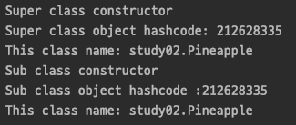
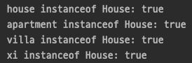
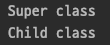
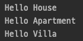
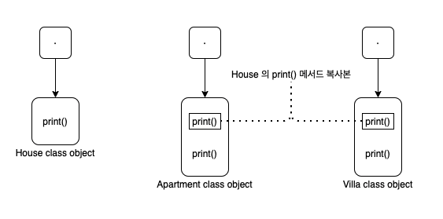
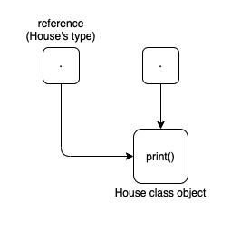
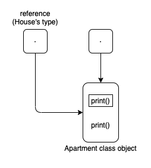
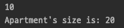
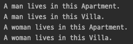

# Java Inheritance

상속은 객체지향 프로그래밍에서 가장 중요한 원칙 중 하나이다.  
자바는 하나의 클래스가 다른 클래스의 기능(필드 또는 메서드)을 상속하도록 허용한다.  

#### Super Class

기능이 상속된 클래스를 수퍼 클래스 또는 부모 클래스 라고 한다.  

#### Sub Class

다른 클래스를 상속받는 클래스를 하위 클래스 또는 자식 클래스 라고 한다.  
하위 클래스는 수퍼 클래스의 기능 외에도 자체 필드 및 메서드를 추가할 수 있다.  

#### Reusability

상속은 '재사용' 개념을 지원한다.  
즉, 새 클래스를 만들고 싶고 원하는 코드 중 일부를 포함하는 다른 클래스가 이미 있는 경우 기존 클래스에서 새 클래스를 파생할 수 있다.  
이를 통해 기존 클래스의 필드와 메서드를 재사용할 수 있다.

```java
public class Bicycle {

    private int gear;
    private int speed;

    public Bicycle(int gear, int speed) {
        this.gear = gear;
        this.speed = speed;
    }

    @Override
    public String toString() {
        return "gear=" + gear +
                ", speed=" + speed;
    }
}

public class MountainBike extends Bicycle {

    private int seatHeight;

    public MountainBike(int gear, int speed, int seatHeight) {
        super(gear, speed);
        this.seatHeight = seatHeight;
    }

    @Override
    public String toString() {
        return super.toString() + ", seatHeight=" + seatHeight;
    }
}

public class Main {

    public static void main(String[] args) {
        MountainBike bike = new MountainBike(10, 100, 50);
        System.out.println(bike);
    }
}
```


MountainBike 클래스의 객체가 생성되면 부모 클래스인 Bicycle 클래스의 모든 메서드와 필드의 복사본 역시 메모리에 할당된다.  

자식 클래스 객체가 생성될 때 부모 클래스는 별도로 객체가 생성되지 않는다.

```java
public class Fruit {

    public Fruit() {
        System.out.println("Super class constructor");
        System.out.println("Super class object hashcode: " + this.hashCode());
        System.out.println("This class name: " + this.getClass().getName());
    }
}

public class Pineapple extends Fruit {

    public Pineapple() {
        System.out.println("Sub class constructor");
        System.out.println("Sub class object hashcode :" + this.hashCode());
        System.out.println("This class name: " + this.getClass().getName());
    }
}

public class Main {

    public static void main(String[] args) {
        Pineapple pineapple = new Pineapple();
    }
}
```



위 코드를 보면, 생성자 호출이 클래스의 객체가 생성되었음을 의미하는 일반적인 가정과 다르다.  
따라서, 클래스 생성자가 실행될 때마다 해당 클래스의 객체가 생성되는지 여부를 맹목적으로 말할 순 없다.  

부모 클래스 객체의 해쉬코드와 자식 클래스 객체의 해쉬코드가 동일하다는 것에서 알 수 있듯이 하나의 객체만 생성되었다는 것을 알 수 있다.  
클래스의 이름도 자식 클래스인 Apple 만을 출력하고 있다.

## 다양한 상속 유형

#### Single Inheritance

```java
class Paper {}
class Document extends Paper {}
```

#### Multilevel Inheritance

```java
class Paper {}
class Document extends Paper {}
class Book extends Document {}
```

#### Hierarchical Inheritance

```java
class Paper {}
class Newspaper extends Paper {}
class Book extends Paper {}
class Box extends Paper {}
```

#### Multiple Inheritance

```java
interface Paper {}
interface Text {}
class Book implements Paper, Text {}
```

## Important facts about inheritance in Java

#### Default superclass

부모 클래스가 없는 Object 클래스를 제외하고, 모든 클래스는 오직 하나의 부모 클래스가 존재한다.  
명시적인 부모 클래스가 없는 경우 모든 클래스는 암시적으로 Object 클래스의 자식 클래스이다.  

#### Superclass can only be one

부모 클래스는 여러 자식 클래스를 가질 수 있지만 자식 클래스는 오직 하나의 부모 클래스만 가질 수 있다.  
자바에서는 클래스를 통한 다중 상속을 지원하지 않기 때문이다.  
다만, 인터페이스를 통한 다중 상속은 지원한다.

#### Inheriting Constructors

자식 클래스는 부모 클래스의 멤버(모든 필드, 메서드, 중첩 클래스)를 상속받는다.  
그러나 생성자는 멤버가 아니기 때문에 상속되지 않는다.  
부모 클래스의 생성자는 자식 클래스에 의해 실행된다.

#### Private member inheritance

자식 클래스는 부모 클래스의 private 멤버를 상속받지 않는다.  
그러나 부모 클래스에서 private 필드에 접근하기 위한 public 또는 protected 메서드(ex. getter(), setter())가 있는 경우 자식 클래스에서도 사용할 수 있다.  

## IS-A relationship

```java
public class Main {

    public static void main(String[] args) {
        final House house = new House();
        final Apartment apartment = new Apartment();
        final Villa villa = new Villa();
        final Xi xi = new Xi();

        System.out.println("house instanceof House: " + (house instanceof House));
        System.out.println("apartment instanceof House: " + (apartment instanceof House));
        System.out.println("villa instanceof House: " + (villa instanceof House));
        System.out.println("xi instanceof House: " + (xi instanceof House));
    }

}


class House {}
class Apartment extends House {}
class Villa extends House {}
class Xi extends Apartment {}
```



#### 자식 클래스에서 할 수 있는 것은 무엇일까?

자식 클래스에서 부모 클래스의 멤버를 그대로 상속하거나 수정하거나 숨기거나 새 멤버로 보완할 수 있다.  
- 상속된 필드는 다른 필드와 마찬가지로 직접 사용할 수 있다.  
- 부모 클래스에 없는 새 필드를 선언할 수 있다.
- 상속된 메서드는 그대로 직접 사용할 수 있다.  
- 부모 클래스에 정의된 메서드를 재정의하여 사용할 수 있다.
- 부모 클래스에 정의된 메서드 시그니처와 동일한 메서드를 자식 클래스에서 새로운 static 메서드로 만들어서 숨길 수 있다.  
이건 확인이 직접 필요하다. 정확히 무슨 의미인지 이해하지 못한 내용이다.
- 부모 클래스에 없는 새 메서드를 선언할 수 있다.
- 묵시적 또는 명시적으로 super 키워드를 사용하여 부모 클래스의 생성자를 호출하는 자식 클래스 생성자를 작성할 수 있다.

## super 키워드

super 키워드를 통해 부모 클래스에 접근할 수 있다.  

#### The super Keyword With Constructors

super() 를 사용하면 부모 클래스의 기본 생성자를 호출할 수 있다.  
생성자 블럭 안에서 반드시 처음 호출되어야 한다.  

#### Accessing Parent Class Variables

```java
public class Main {
    public static void main(String[] args) {
        new ChildStudy().printParentMessage();
    }
}

class ParentStudy {
    String message = "Super class";
}

class ChildStudy extends ParentStudy {
    String message = "Child class";

    public void printParentMessage() {
        System.out.println(super.message);
    }
}
```


자식 클래스에서 super 키워드를 통해 부모 클래스의 변수에 접근할 수 있다.

#### The super Keyword With Method Overriding

```java
public class Main {
    public static void main(String[] args) {
        new ChildStudy().printMessage();
    }
}

class ParentStudy {
    String message = "Super class";

    public void printMessage() {
        System.out.println(message);
    }
}

class ChildStudy extends ParentStudy {
    String message = "Child class";

    public ChildStudy() {
        super.printMessage();
    }

    @Override
    public void printMessage() {
        System.out.println(message);
    }
}
```



super 키워드를 사용하여 자식 클래스에서 재정의된 메서드라도 접근할 수 있다.

## Method Overriding

부모 클래스에 정의된 메서드에 대하여 재정의를 통해 자식 클래스에서 세분화된 구현을 제공할 수 있다.  

#### Type Substitutability

OOP 의 핵심 원칙은 [LSP](https://github.com/oh29oh29/read-and-learn/blob/master/books/clean-architecture/Chapter09.md) 와 밀접한 관련이 있는 타입 치환 가능성이다.  
즉, LSP 는 어플리케이션이 주어진 기본 타입으로 작동하는 경우 하위 타입이어도 작동해야한다는 것을 의미한다.  

메서드 재정의의 가장 큰 문제는 하위 클래스의 일부 특정 메서드 구현이 LSP 를 완전히 준수하지 않아 타입 치환 가능성을 유지하지 못할 수 있다는 것이다.  
물론, 다른 타입의 인수를 받아들이고 다른 타입도 반환하도록 재정의된 메서드를 만드는 것이 유효하지만 다음 규칙을 완전히 준수해야한다.  

- 부모 클래스의 메서드에 특정 타입의 인수가 있다면, 재정의하는 메서드는 동일하거나 부모 타입의 인수로 재정의되어야 한다.
- 부모 클래스의 메서드가 void 를 리턴한다면, 재정의하는 메서드도 void 리턴 해야한다.
- 부모 클래스의 메서드가 primitive 타입을 리턴한다면, 재정의하는 메서드도 primitive 타입을 리턴 해야한다.
- 부모 클래스의 메서드가 특정 타입을 리턴한다면, 재정의하는 메서드도 동일하거나 하위 타입으로 리턴 해야한다.
- 부모 클래스의 메서드가 exception 을 발생시킨다면, 재정의하는 메서드도 동일한 exception 또는 하위 exception 을 발생시켜야 한다.

#### Dynamic Binding

메서드 재정의는 부모 타입과 하위 타입의 계층이 있는 상속으로만 구현될 수 있고 부모 클래스와 하위 클래스 모두 동일한 메서드를 정의하기 때문에 컴파일러는 호출할 메서드를 컴파일 시점에 결정할 수 없다.  

결과적으로 컴파일러는 어떤 메서드를 호출해야하는지 알기 위해 객체 타입을 확인해야 한다.  
이 확인은 런타임 시 가능하므로 메서드 재정의는 동적 바인딩의 전형적인 예가 된다.

## Dynamic Method Dispatch

메서드 재정의는 Java 가 런타임 다형성을 지원하는 방법 중 하나이다. 
Dynamic method dispatch 는 컴파일 타임이 아니라 런타임에 재정의된 메서드에 대한 호출을 확인하는 메커니즘이다.

재정의된 메서드가 부모 클래스 참조를 통해 호출되면 Java 는 호출이 발생할 때 참조되는 객체의 타입에 따라 메서드의 어떤 버전이 실행될 것인지 결정한다.

```java
public class Main {
    public static void main(String[] args) {
        House house = new House();
        Apartment apartment = new Apartment();
        Villa villa = new Villa();

        House reference;

        reference = house;
        reference.print();

        reference = apartment;
        reference.print();

        reference = villa;
        reference.print();
    }
}

class House {
    void print() {
        System.out.println("Hello House");
    }
}

class Apartment extends House {
    @Override
    void print() {
        System.out.println("Hello Apartment");
    }
}

class Villa extends House {
    @Override
    void print() {
        System.out.println("Hello Villa");
    }
}
```



Main 클래스의 main() 메서드 안에서 처음에는 House, Apartment, Villa 타입의 객체가 선언된다.

```java
House house = new House();
Apartment apartment = new Apartment();
Villa villa = new Villa();
```



이제 각 객체 타입에 대한 참조를 reference 에 하나씩 할당하고 해당 참조를 사용하여 print() 를 호출한다.  
출력에서 알 수 있듯이 실행된 print() 의 버전은 호출 시 참조되는 객체 타입에 따라 결정된다.  

```java
reference = house;
reference.print();  // calling House's version of print()
```



```java
reference = apartment;
reference.print();  // calling Apartment's version of print()
```



Java 에서 재정의는 오직 메서드만 가능하다.  
따라서 변수와 같은 멤버에 대해서는 다형성이 적용되지 않는다.  

```java
public class Main {
    public static void main(String[] args) {
        House house = new Apartment();
        System.out.println(house.size);
        house.printSize();
    }
}

class House {
    int size = 10;

    void printSize() {
        System.out.println("House's size is:  " + size);
    }
}

class Apartment extends House {
    int size = 20;

    @Override
    void printSize() {
        System.out.println("Apartment's size is: " + size);
    }
}
```



변수는 재정의가 되지 않기 때문에 `house.size` 는 항상 부모 클래스의 변수를 참조한다.

#### Advantages of Dynamic Method Dispatch

Dynamic method dispatch 는 Java 가 런타임 다형성에 중요한 메서드의 재정의를 지원할 수 있도록 한다.  
Dynamic method dispatch 를 통해 클래스는 모든 하위 클래스에서 공통으로 쓰이는 메서드를 정의할 수 있으며, 하위 클래스는 이런 메서드의 일부 또는 전체를 재정의할 수 있다.  

#### Static vs Dynamic binding

Static 바인딩은 컴파일 타임에 수행되고 Dynamic 바인딩은 런타임 동안 수행된다.  
private, final, static 메서드 및 변수는 Static 바인딩을 하는 반면에, 재정의된 메서드는 런타임 객체 타입에 따라 바인딩 한다.

## Double Dispatch

Dynamic method dispatch 가 두번 일어나는 것을 Double dispatch 라고 한다.  

```java
public class Main {
    public static void main(String[] args) {
        final List<Human> humans = List.of(new Man(), new Woman());
        final List<House> houses = List.of(new Apartment(), new Villa());
        humans.forEach(human -> houses.forEach(human::print));
    }
}

interface House {
    void printWhoLivesIn(Man man);
    void printWhoLivesIn(Woman woman);
}
class Apartment implements House {
    @Override
    public void printWhoLivesIn(Man man) {
        System.out.println("A man lives in this Apartment.");
    }

    @Override
    public void printWhoLivesIn(Woman woman) {
        System.out.println("A woman lives in this Apartment.");
    }
}
class Villa implements House {
    @Override
    public void printWhoLivesIn(Man man) {
        System.out.println("A man lives in this Villa.");
    }

    @Override
    public void printWhoLivesIn(Woman woman) {
        System.out.println("A woman lives in this Villa.");
    }
}

interface Human {
    void print(House house);
}
class Man implements Human {
    @Override
    public void print(House house) {
        house.printWhoLivesIn(this);
    }
}
class Woman implements Human {
    @Override
    public void print(House house) {
        house.printWhoLivesIn(this);
    }
}
```



#### Visitor Pattern

방문자 패턴은 더블 디스패치를 이용한 대표적인 패턴이라고 한다.  
이 내용은 추후 디자인 패턴을 공부하면서 알아보도록 하겠다.  

## Abstraction

데이터 추상화는 필수 세부 데이터만 사용자에게 표시되는 속성이다.  
객체의 속성 및 동작은 유사한 타입의 다른 객체와 구별되며 객체를 분류 및 그룹화하는데 도움이 된다.  
Java 에서 추상화는 인터페이스와 추상 클래스에 의해 이루어진다.  

#### Abstract classes and Abstract methods

1. 추상 클래스는 abstract 키워드로 선언된 클래스이다.
2. 추상 메서드는 구현없이 선언된 메서드이다.  
3. 추상 클래스의 메서드는 모두 추상 메서드일 수도 있고 아닐수도 있다. 일부 메서드는 구현되어 있을 수 있다.  
4. 추상 메서드는 항상 하위 클래스에서 재정의 되어야 하거나 하위 클래스 자체를 추상화해야 한다.
5. 추상 메서드가 하나 이상일 경우 그 클래스는 abstract 로 선언해야 한다.
6. 추상 클래스는 new 키워드로 직접 인스턴스화 할 수 없다.
7. 추상 클래스는 argument 가 존재하는 생성자를 가질 수 있으며 기본 생성자는 항상 추상 클래스에 존재한다.  

## final 키워드

final 키워드는 변수, 메서드 또는 클래스에만 적용 할 수 있는 키워드이다.

#### final variable

변수 앞에 final 이 붙으면, 그 변수는 immutable 임을 의미한다.  
즉, 상수라고 할 수 있다.

#### final classes

클래스에 final 이 붙으면, 그 클래스는 다른 클래스에게 상속할 수 없음을 의미한다.

#### final methods

메서드에 final 이 붙으면, 그 메서드는 다른 클래스에서 재정의할 수 없음을 의미한다.  

## Object class

Object 클래스는 java.lang 패키지에 존재한다.  
Java 의 모든 클래스는 Object 클래스에서 직접 또는 간접적으로 상속받고 있다.  
따라서 모든 Java 클래스에서 Object 클래스 메소드를 사용할 수 있다.  

#### Using Object class methods

##### 1. toString()

toString() 메서드는 객체의 문자열 표현을 제공하며 객체를 문자열로 변환하는 데 사용된다.  
Object 클래스의 기본 toString() 메서드는 인스턴스의 해당 클래스의 이름, at-sign 문자(@) 및 객체의 해시 코드에 대한 부호없는 16 진수 표현으로 구성된 문자열을 반환한다.  

##### 2. hashCode()

모든 객체에 대해 JVM 은 해시 코드 인 고유 번호를 생성하고 고유한 객체에 대해 고유한 정수를 반환한다.  
hashCode() 메서드에 대한 공부는 더 필요하며, 추후 추가할 예정이다.

##### 3. equals(Object obj)

매개변수로 받은 객체를 this 객체와 비교한다.

<hr>

#### References

> 웹 문서
> - [geeksforgeeks | Inheritance in Java](https://www.geeksforgeeks.org/inheritance-in-java/)
> - [geeksforgeeks | Java Object Creation of Inherited Class](https://www.geeksforgeeks.org/gfact-52-java-object-creation-of-inherited-classes/)
> - [geeksforgeeks | Dynamic Method Dispatch or Runtime Polymorphism in Java](https://www.geeksforgeeks.org/dynamic-method-dispatch-runtime-polymorphism-java/)
> - [geeksforgeeks | Overriding in Java](https://www.geeksforgeeks.org/overriding-in-java/)
> - [geeksforgeeks | Abstraction in Java](https://www.geeksforgeeks.org/abstraction-in-java-2/)
> - [geeksforgeeks | final keyword in java](https://www.geeksforgeeks.org/final-keyword-java/)
> - [geeksforgeeks | Object class in Java](https://www.geeksforgeeks.org/object-class-in-java/)
> - [baeldung | Guide to Inheritance in Java](https://www.baeldung.com/java-inheritance)
> - [baeldung | Guide to the super Java Keyword](https://www.baeldung.com/java-super)
> - [baeldung | Method Overloading and Overriding in Java](https://www.baeldung.com/java-method-overload-override)
> - [baeldung | Double Dispatch in DDD](https://www.baeldung.com/ddd-double-dispatch)
